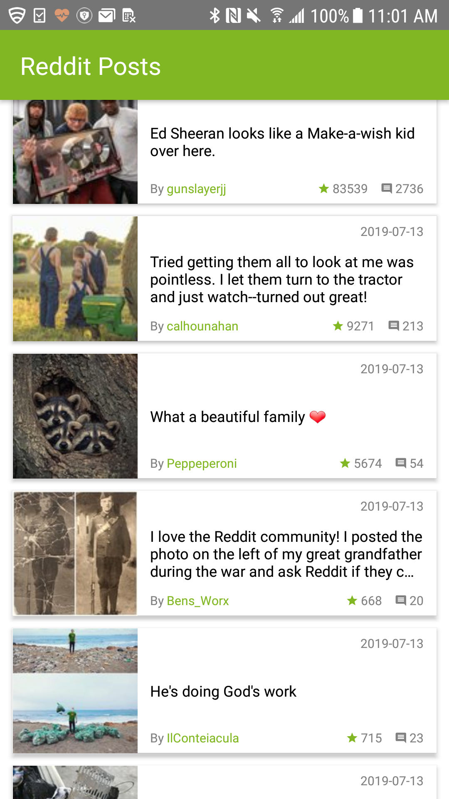

## Design concepts

### List screen
- Used FlatList component for performant list rendering experience
- Used Infinite scrolling behavior as there are huge number of posts to fetch from
  note: `afterPage` property of the API endpoint indicates the next set of posts to fetch

### Post screen
- Used WebView as instructed
- Made backward navigation possible
- Put post title as the navBar title

## Technologies used

### State management
Redux / Redux-saga

### Asynchronous API inquiry
Axios

### UI framework
React-native-elements

### Other UI packages
React-native-spinkit

### Navigation infrastructure
React-navigation

## Additional
ESLint with airBnB style
`npm run lint`
